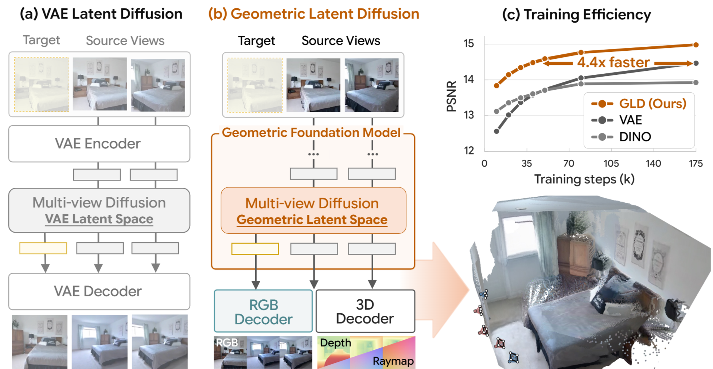

# Geometric Latent Diffusion: Repurposing Geometric Foundation Models for Multi-view Diffusion

[Wooseok Jang](https://scholar.google.com/citations?hl=ko&user=7cyLEQ0AAAAJ)<sup>1</sup>, [Seonghu Jeon](https://jeonseonghu.github.io/about-me)<sup>1</sup>, [Jisang Han](https://onground-korea.github.io/)<sup>1</sup>, [Jinhyeok Choi](https://wlsguur.github.io/)<sup>1</sup>, [Minkyung Kwon](https://mkxdxdxd.github.io/)<sup>1</sup>, [Seungryong Kim](https://scholar.google.com/citations?user=cIK1hS8AAAAJ)<sup>1</sup>, [Saining Xie](https://www.sainingxie.com/)<sup>2</sup>, [Sainan Liu](https://www.sainanliu.com/)<sup>3</sup>

<sup>1</sup>KAIST &nbsp; <sup>2</sup>New York University &nbsp; <sup>3</sup>Intel Labs

<p align="center">
  <a href="https://cvlab-kaist.github.io/GLD/"></a>
  <a href="https://arxiv.org/abs/2603.22275"></a>
  <a href="https://huggingface.co/SeonghuJeon/GLD"></a>
</p>

<p align="center">
  
</p>

## News

- **2026-03-25**: Clean up camera conventions and remove unused debugging code. All input cameras are now expected in **OpenCV convention** (X-right, Y-down, Z-forward) + Updated Checkpoint.
- **2026-03-24**: Initial code and model release.

## Overview

**GLD** performs multi-view diffusion in the feature space of geometric foundation models ([Depth Anything 3](https://github.com/DepthAnything/Depth-Anything-3) / [VGGT](https://github.com/facebookresearch/vggt)), enabling novel view synthesis with zero-shot geometry — trained from scratch without text-to-image pretraining.

- **4.4× faster** training convergence vs. VAE-based approaches
- **Zero-shot depth & 3D** from synthesized latents via frozen decoders
- **State-of-the-art** on RE10K and DL3DV benchmarks

## Requirements

- **GPU**: 48GB+ VRAM recommended (e.g., A6000, A100). Cascade mode loads two DiT models simultaneously.
- **Python**: 3.10+

## Installation

```bash
conda env create -f environment.yml
conda activate gld
```

## Pretrained Models

Download all checkpoints from HuggingFace:

```bash
# Download all model weights
python -c "from huggingface_hub import snapshot_download; snapshot_download('SeonghuJeon/GLD', local_dir='.')"
```

This places files as follows:

```
pretrained_models/
  da3/
    model.safetensors              # DA3-Base encoder weights
    dpt_decoder.pt                 # DPT decoder (depth + geometry)
  mae_decoder.pt                   # DA3 MAE decoder (RGB)
  vggt/
    mae_decoder.pt                 # VGGT MAE decoder (RGB)

checkpoints/
  da3_level1.pt                    # DA3 level-1 diffusion
  da3_cascade.pt                   # DA3 cascade (level-1 → level-0)
  vggt_level1.pt                   # VGGT level-1 diffusion
  vggt_cascade.pt                  # VGGT cascade (level-1 → level-0)

model_stats/                       # Latent normalization statistics
  da3/normalization_stats_level{0,1}.pt
  vggt/normalization_stats_level{0,1}.pt
  vggt/special_stats_level{0,1}.pt
```

> **Note**: `model_stats/` and `configs/` are already included in the Git repository — they are **not** downloaded from HuggingFace. Make sure to `git clone` the repo first, then run `snapshot_download` inside the cloned directory.

## Quick Demo

```bash
# DA3 backbone
./run_demo.sh da3

# VGGT backbone
./run_demo.sh vggt
```

This runs NVS on included demo scenes and generates 3D reconstructions (GLB + COLMAP).
To specify a GPU: `./run_demo.sh da3 <GPU_ID>`


_NOTE: For now, 3D reconstruction is supported for DA3 Only. 3D Reconstruction code for VGGT checkpoint will be updated soon!_


## Training

### Stage 2: Multi-view Diffusion

```bash
# DA3 level-1
./run_train.sh da3 level1

# DA3 cascade (level-1 → level-0)
./run_train.sh da3 cascade

# VGGT level-1
./run_train.sh vggt level1
```

Multi-GPU: edit `--nproc_per_node` in `run_train.sh`.

### Stage 1: Decoder Training

Train the MAE decoder (RGB reconstruction) on frozen DA3 encoder features with GAN + LPIPS losses:

```bash
./scripts/run_train_stage1_mae.sh [NUM_GPUS] [RESUME_CKPT]

# Example: 4 GPUs
./scripts/run_train_stage1_mae.sh 4

# Resume from checkpoint
./scripts/run_train_stage1_mae.sh 4 results/stage1-mae/.../checkpoints/0050000.pt
```

See `configs/training/DA3_stage1_mae.yaml` for training hyperparameters.

## Evaluation

```bash
# DA3 cascade (default)
./eval_gld.sh da3 cascade

# VGGT cascade
./eval_gld.sh vggt cascade

# Independent (single level, no cascade)
./eval_gld.sh da3 independent
```

## Project Structure

```
├── src/
│   ├── stage1/                    # Feature encoder (DA3/VGGT) + decoders (MAE/DPT)
│   ├── stage2/                    # DiT diffusion transformer
│   ├── utils/                     # Metrics, camera, config, validation
│   ├── datasets/                  # Eval dataset adapter
│   ├── video/                     # Training data loaders (CUT3R format)
│   ├── train_multiview_da3.py     # Stage 2 training
│   ├── train_stage1_mae.py        # Stage 1 decoder training
│   └── eval_gld_metric.py
├── configs/
│   ├── training/                  # Model configs (DA3/VGGT × level1/cascade)
│   └── eval/                      # Evaluation configs
├── demo/                          # Demo scenes (RE10K + DL3DV)
├── scripts/                       # 3D reconstruction utilities
├── run_train.sh
├── eval_gld.sh
├── run_demo.sh
└── environment.yml
```

## Citation

```bibtex
@article{jang2026gld,
  title={Repurposing Geometric Foundation Models for Multi-view Diffusion},
  author={Jang, Wooseok and Jeon, Seonghu and Han, Jisang and Choi, Jinhyeok and Kwon, Minkyung and Kim, Seungryong and Xie, Saining and Liu, Sainan},
  journal={arXiv preprint arXiv:2603.22275},
  year={2026}
}
```

## Acknowledgements

Built upon [RAE](https://github.com/nicknign/RAE_release), [Depth Anything 3](https://github.com/DepthAnything/Depth-Anything-3), [VGGT](https://github.com/facebookresearch/vggt), [CUT3R](https://github.com/naver/CUT3R), and [SiT](https://github.com/willisma/SiT).
